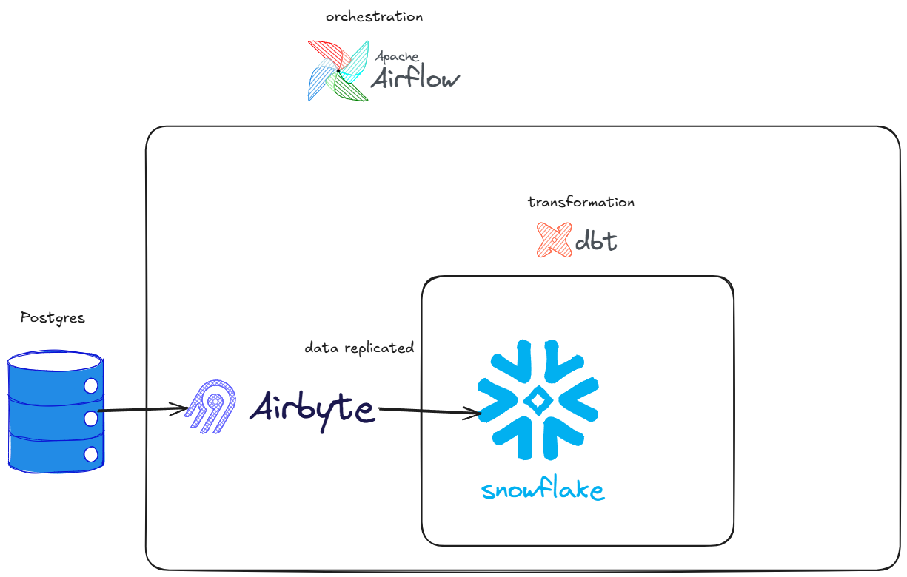

# airbyte + airflow + dbt + snowflake + postgres project 
short project description: transactional data is present in postgres database and our goal is to get this data into snowflake and make it analytics ready, for that we use airbyte data replication to replicate our database to snowflake, dbt for transformations on data extracted by airbyte and airfow for orchestrating replication and transformation of data.

# Architecture

# requirements:
Docker installed. [Docker installation](https://docs.docker.com/desktop/setup/install/windows-install/)

abctl installed. [Airbyte installation](https://docs.airbyte.com/platform/using-airbyte/getting-started/oss-quickstart)

poetry installed. [Poetry installation](https://python-poetry.org/docs/)

terraform installed. [Terraform installation](https://developer.hashicorp.com/terraform/tutorials/aws-get-started/install-cli)

snowflake working account with admin permissions. [Snowflake sign up](https://signup.snowflake.com/)

## setup guide:

clone the repository
    
    git clone git@github.com:Strelok2003/BigDataIntership.git

change into [airbyte_dbt](../airbyte_dbt/) folder

set up and run airbyte with docker

    https://docs.airbyte.com/platform/using-airbyte/getting-started/oss-quickstart

set up necessary objects for airbyte in snowflake by running [setup_for_airbyte.sql](./snowflake_scripts/setup_for_airbyte.sql) script, only change password if wanted

change into [pagila_postgres](./pagila_postgres/) folder, set up read_only user to your liking [readonly-user.sql](./pagila_postgres/readonly-user.sql) (this user will be used for airbyte) and run postgres server

    docker compose up -d

change into [airbyte_terraform](./airbyte_terraform/) folder, install required providers 

    terraform init

set up variables for terraform by creating terraform.tfvars file

    airbyte_username = username give by "abctl local credentials"
    airbyte_password = password give by "abctl local credentials"

    postgres_password  = password in "readonly-user.sql"
    workspace_id       = while accessing airbyte UI, id after "/workspaces/"
    
    aribyte_server_url = "http://localhost:8000/api/public/v1/"

    snowflake_host     = snowflake Account/Server URL
    snowflake_password = password for airbyte user in "setup_for_airbyte.sql"

create airbyte objects with terraform

    terraform apply
    
save "airbyte_connection_id" outputed by terraform you will need it in airflow, if you cleared console before saving "airbyte_connection_id" then you can see it again by running this command

    terraform output

set up airflow user and password

    create simple_auth_manager_passwords.json.generated file and populate it with following: 

        {"airflow_ui_user": "airflow_ui_password"}

    this user and password is what you will use when accessing airflow UI

set up env variables for airflow, create .env file in [airflow](./airflow/) with following env variables

    AIRBYTE_CLIENT_ID= client-id given by "abctl local credentials"

    AIRBYTE_CLIENT_SECRET= client-secret given by "abctl local credentials"
    
    AIRBYTE_POSTGRES_TO_SNOWFLAKE_CONN_ID= airbyte_connection_id outputed by terraform

    theese variables are necessary for airfow to connect airbyte

create profiles.yml for dbt with snowflake credentials in ~/.dbt.profiles.yml [dbt profiles.yml](https://docs.getdbt.com/docs/local/profiles.yml?version=2.0)

set up necessary objects for dbt in snowflake by running [setup_for_dbt.sql](./snowflake_scripts/setup_for_dbt.sql) script, only change password if wanted

run airflow serivce in [ariflow](./airflow/) folder

    docker compose up -d

access airflow ui
    
    localhost:8080

## cleanup guide:

for airbyte object destruction in [airbyte_terraform](./airbyte_terraform/) folder run:

    terraform destroy

for snowflake objects destruction in [snowflake_scripts](./snowflake_scripts/) folder run cleanup scripts
